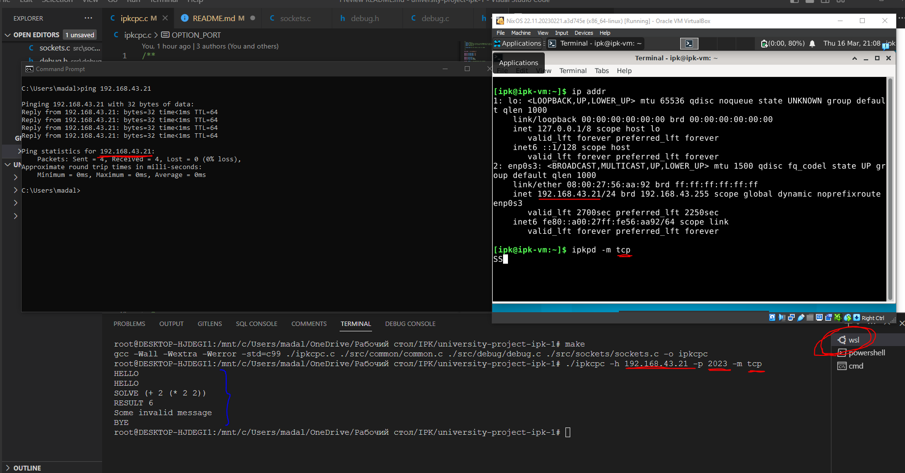
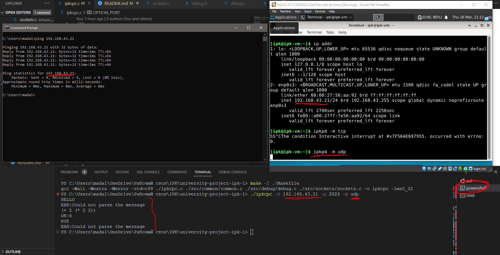

## Calculator Protocol Documentation
### Introduction
The program (client) is designed to connect to any TCP and UDP server. It's written in C programming language and uses [socket API](https://www.geeksforgeeks.org/socket-programming-cc/) to create and manage network connections. The program can be compiled on both Linux and Windows platforms.

### Features
- Connects to any TCP or UDP server
- Sends and recieves data over network
- Handles primitive errors and exceptions, deals with invalid ports and hosts.

### Compilation
This project can be compiled using Makefile:
```bash
make
```
If you are using windows, you might want to compile like this:
```bash
make -f .\Makefile
```

The project is configured to be able to compile on Linux or Windows.

### Usage

You can run client using following command:
```bash
./ipkcpc -h <host> -p <port> -m <mode>
```

`-h` ip address of the system where server is running<br/>
`-p` server's port<br/>
`-m` mode in which server is running (tcp/udp)<br/>
`--help` prints usage for the user<br/>

> **Note**<br/>
All the options described above are **required** in order to connect to the server.

Once the program started, if credentials you provided are valid, you can start typing to a server.


### Error Handling
The client program has handlers to validate internal network errors and input data, provided by a user. If error occurs, the program will throw error message to *STDERR*, cleaning data up.  Error message has format `[ERROR]:<err-message>`. 

The program works like a [telnet](https://cs.wikipedia.org/wiki/Telnet). In udp mode, for the cases when port or ip is unreachable, there is `5s` delay until timeout.

### Debugging
You can enable DEBUG mode, by uncommenting this line in `debug.h`
```c
//#define DEBUG
```

In this mode the program will give you detailed information of what it does at **each section of the code**. This was done in order to prevent commenting each line of the code due to project task.


### Testing
Client is tested by over 100 auto-generated tests. File `test.sh` is a main file for testing connection, sending reuqests and getting responses from the server.

> **Note** <br/>
Testing is available only on Unix, since it's native platform for this project.

Usage:
```sh
./test.sh -h <host> -p <port> -m <mode>
```

If some tests are failed you will se following output produced by `diff` command:
```bash
< OK:6
---
> OK:3
```

Example images are here just to show client program on Linux or Windows being able to communicate to the server TCP/UDP.

**Linux client and TCP server**

**Windows client and UDP server**


### Useful links

[Simple socket's tutor](https://www.cs.rpi.edu/~moorthy/Courses/os98/Pgms/socket.html)<br/>
[TCP vs UDP blog](https://www.lifesize.com/blog/tcp-vs-udp/)<br/>
[Writing portable code](https://www.delphipower.xyz/guide_6/writing_portable_code.html)<br/>
[Windows. Using event objects](https://learn.microsoft.com/en-us/windows/win32/sync/using-event-objects)
